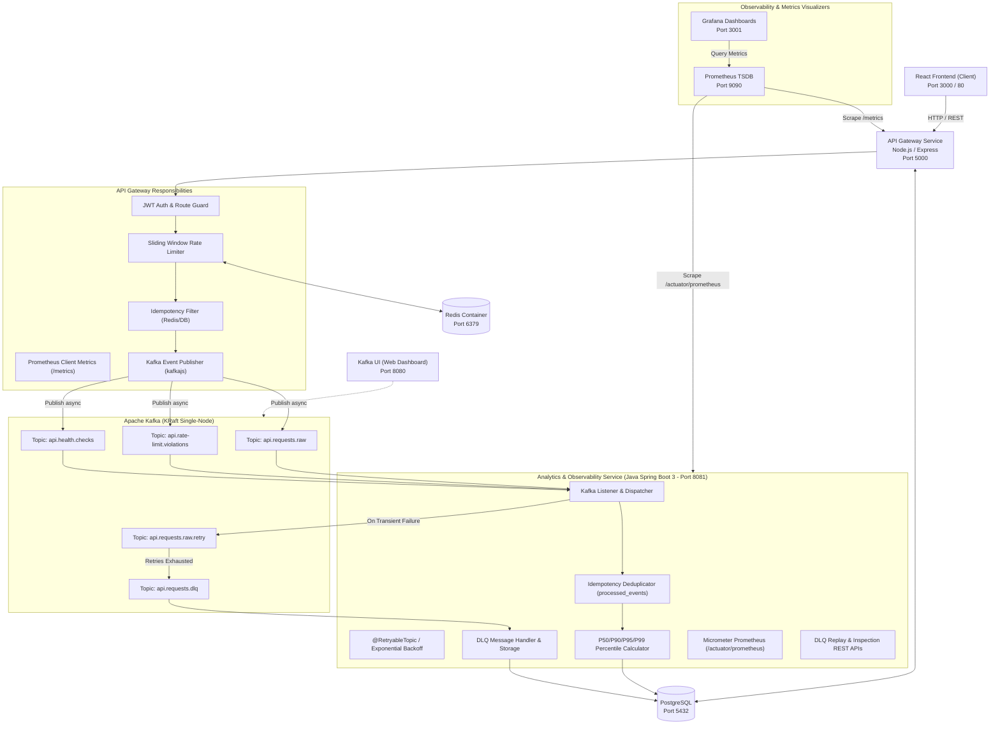

# API Observability & Event-Driven Microservices Platform

A production-grade distributed developer platform that manages API endpoints, enforces configurable sliding-window rate limits, streams observability telemetry through **Apache Kafka**, calculates real-time analytics using a dedicated **Java / Spring Boot Microservice** with **Idempotent Event Processing**, **Exponential Retries**, and **Dead Letter Queue (DLQ)** management, and exposes deep system telemetry through **Prometheus** & **Grafana**.

---

## 🏛️ Microservices Architecture & System Design



---

## 🛠 Tech Stack

- **API Gateway Service**: Node.js, Express, KafkaJS, `prom-client`, Redis, PostgreSQL, Axios, JWT
- **Analytics Microservice**: Java 17, Spring Boot 3.2, Spring Kafka, Spring Boot Actuator, Micrometer Prometheus, Spring Data JPA, Hibernate, PostgreSQL, Lombok
- **Telemetry & Dashboards**: Prometheus (TSDB Scraper), Grafana (Time-Series Dashboards), Kafka UI
- **Event Streaming & Resilience**: Apache Kafka (KRaft mode), Non-blocking Retries (`@RetryableTopic`), Dead Letter Queue (`.dlq`)
- **Frontend**: React (Vite), Tailwind CSS, Material Design 3, Lucide-React
- **Databases & Cache**: PostgreSQL 16, Redis 7 (with atomic Lua sliding-window script)
- **Containerization**: Docker, Docker Compose (multi-container orchestration)
- **Automated Testing Frameworks**: 
  - **Unit Testing**: JUnit 5, Mockito, AssertJ
  - **Integration Testing**: Spring Boot Test with `@EmbeddedKafka` & Awaitility, Postman/Newman with PostgreSQL SQL integrity assertions
  - **E2E UI Testing**: Selenium WebDriver 4, TestNG, Page Object Model (POM)

---

## 🌟 Key Capabilities

1. **Microservices Decomposition**: Decoupled high-speed edge proxying (Gateway) from heavy data analysis (Analytics Service) via asynchronous Kafka message passing.
2. **Kafka Event-Driven Streaming**:
   - `api.requests.raw`: Non-blocking real-time stream of all gateway invocations.
   - `api.rate-limit.violations`: Published when a client breaches quota limits (HTTP 429).
   - `api.health.checks`: Emitted during background availability probes.
3. **Dual-Layer Idempotency & Deduplication**:
   - **HTTP-level Idempotency**: Intercepts mutating requests using `Idempotency-Key` headers with Redis & PostgreSQL response caching (`idempotency_keys`).
   - **Consumer-level Event Deduplication**: Implements idempotent event processing with persistent deduplication via atomic database locking on `processed_events(event_id)` to eliminate duplicate processing effects.
4. **Resilience, Retries & Dead Letter Queue (DLQ)**:
   - Configures non-blocking retries with exponential backoff (`delay = 1000ms`, `multiplier = 2.0`, `maxAttempts = 3`).
   - Poison or unprocessable messages automatically divert to Dead Letter Topics (`api.requests.dlq`) with full diagnostic headers (`x-original-topic`, `x-exception-message`, `x-exception-stacktrace`).
   - Admin REST API provides on-demand inspection and message replay (`POST /api/analytics/dlq/reprocess/{id}`).
5. **Prometheus & Grafana Observability**:
   - Scrapes real-time gateway metrics (`http_requests_total`, `http_request_duration_seconds`, `rate_limit_violations_total`, `kafka_events_emitted_total`).
   - Scrapes Spring Boot JVM and custom microservice metrics (`analytics.events.consumed`, `analytics.idempotency.duplicates`, `analytics.dlq.pending.count`).
   - Pre-provisioned Grafana dashboard (`http://localhost:3001`) with live throughput (RPS), P50/P95/P99 latencies, 429 violation rates, and DLQ gauges.
6. **Multi-Container Docker Orchestration**: One-click local and production startup using `docker-compose.yml`.

---

## 🚀 Quickstart with Docker Compose

To start the entire distributed microservices platform, Kafka broker, databases, and monitoring dashboards:

```bash
docker compose up -d --build
```

### Services & Port Mappings:

| Service | URL / Port | Credentials | Description |
| :--- | :--- | :--- | :--- |
| **Client Frontend** | `http://localhost:80` (or `3000`) | — | React Material Design 3 Web Dashboard |
| **API Gateway** | `http://localhost:5000` | — | REST API Gateway, Proxy & Kafka Producer |
| **Analytics Service** | `http://localhost:8081` | — | Spring Boot Kafka Consumer & Observability Service |
| **Grafana Dashboard** | `http://localhost:3001` | `admin` / `admin` | Pre-provisioned Observability & Telemetry Dashboards |
| **Prometheus TSDB** | `http://localhost:9090` | — | Metrics Scraper & Time-Series Database |
| **Kafka UI** | `http://localhost:8080` | — | Web UI for inspecting Kafka topics, consumer groups & DLQs |
| **Apache Kafka** | `localhost:9092` | — | Event Streaming Broker (KRaft mode) |
| **PostgreSQL** | `localhost:5434` | `postgres` / `postgres_docker_pass` | Relational Storage (mapped from container 5432) |
| **Redis** | `localhost:6380` | — | Distributed Rate Limiter Cache (mapped from container 6379) |

---

## 🧪 Testing Suite

### 1. Spring Boot Unit & Integration Tests (JUnit 5 + Mockito + EmbeddedKafka)
```bash
cd services/analytics-service
mvn clean test
```
- `IdempotencyServiceTest`: Verifies atomic locking, duplicate suppression, and concurrency protection.
- `RequestEventConsumerTest`: Tests message consumption, transformation, and poison pill exception handling.
- `DlqManagementServiceTest`: Tests DLQ message recording, discarding, and Kafka reprocessing.
- `MetricsAggregationServiceTest`: Tests P50/P90/P95/P99 latency calculations.
- `KafkaConsumerIntegrationTest`: End-to-end integration test with `@EmbeddedKafka` testing event consumption and deduplication.

### 2. API Gateway & Rate Limiting Tests (Postman + Newman + SQL Assertions)
```bash
cd tests
npm test
```

### 3. Selenium WebDriver UI E2E Automation Tests (Java + TestNG)
```bash
cd tests/ui
mvn clean test -DbaseUrl=http://localhost:5000
```
